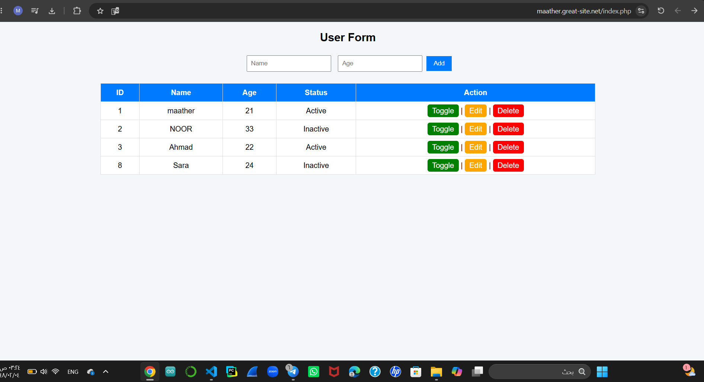

# 🧑‍💻 User Management System

## 📌 Description
This project is a simple web-based system that allows users to:
- Add user data (Name, Age)
- Store data in a MySQL database
- Display all users in a table
- Toggle user status (Active / Inactive)
- Edit and delete users

---

## 🛠️ Technologies Used

### 1. HTML
Used to build the structure of the webpage:
- Form (Name, Age, Submit)
- Table to display data

### 2. CSS
Used for styling:
- Page layout
- Table design
- Buttons (Toggle, Edit, Delete)

### 3. PHP
Used for backend logic:
- Connect to MySQL database
- Insert data into database
- Retrieve and display data
- Delete and update records

### 4. JavaScript
Used for interactivity:
- Toggle status without reloading the page (AJAX using fetch)

---

## ⚙️ Features

- ✅ Add new user
- ✅ Display all users
- ✅ Toggle status (0 ⇄ 1)
- ✅ Update status instantly without page refresh
- ✅ Delete user with confirmation
- ✅ Edit user (optional if implemented)

---

## 🗄️ Database Structure

Table name: users

| Column | Type |
|------|------|
| ID | INT (Primary Key, Auto Increment) |
| Name | VARCHAR |
| Age | INT |
| Status | TINYINT (0 or 1) |

---

## 📸 Screenshot

---

## 🔗 Live Demo

---

## 🚀 How It Works

1. User enters Name and Age in the form
2. PHP sends data to MySQL database
3. Data is stored in users table
4. Table displays all users
5. Clicking Toggle updates status using JavaScript + PHP
6. Status updates instantly without refreshing the page

